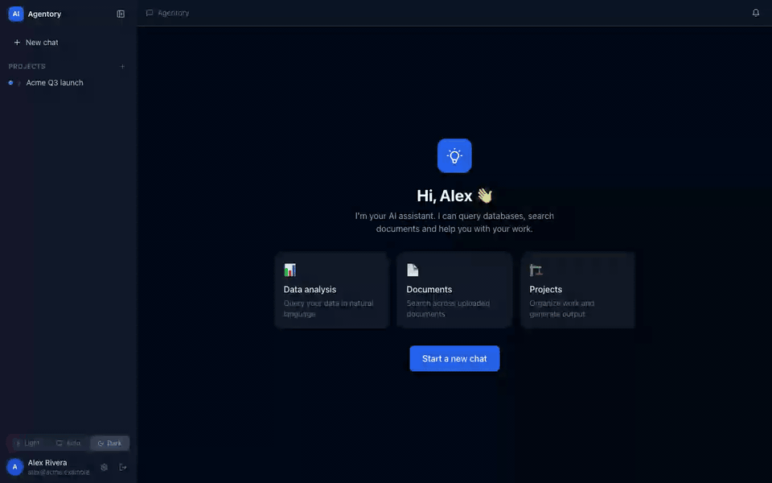
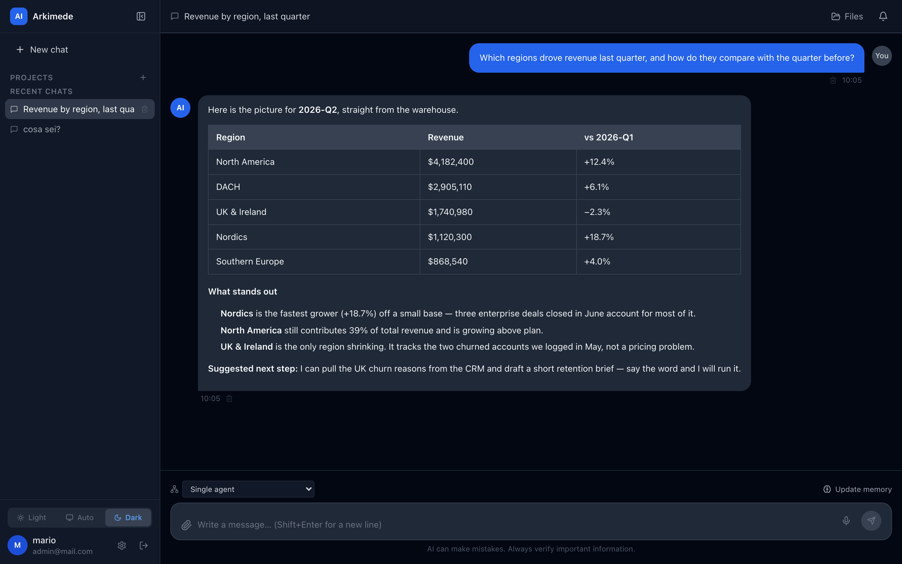
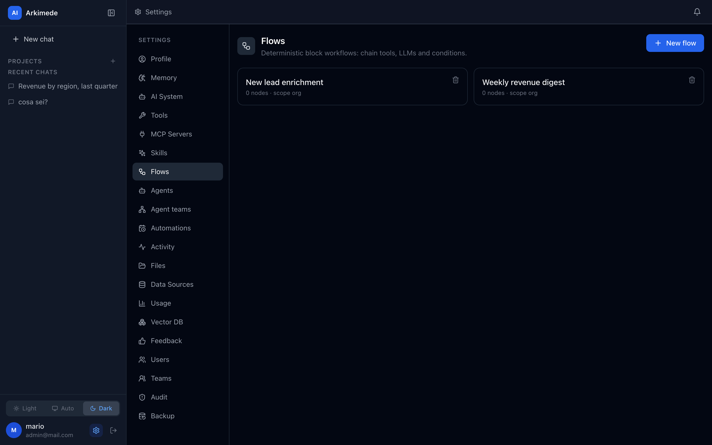
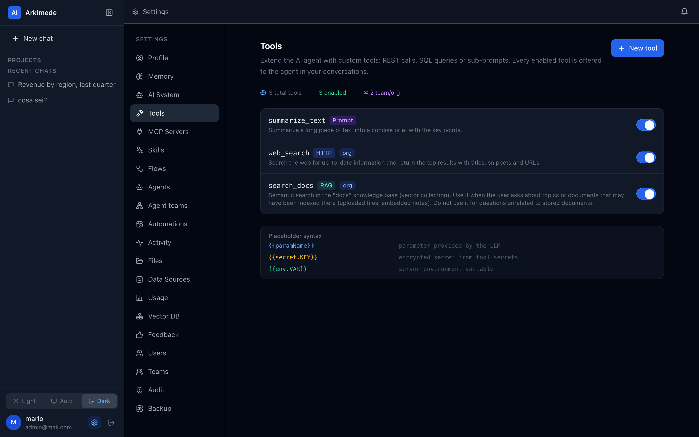
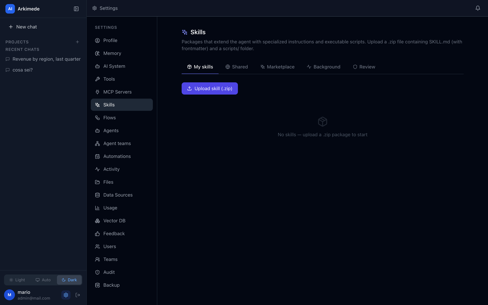
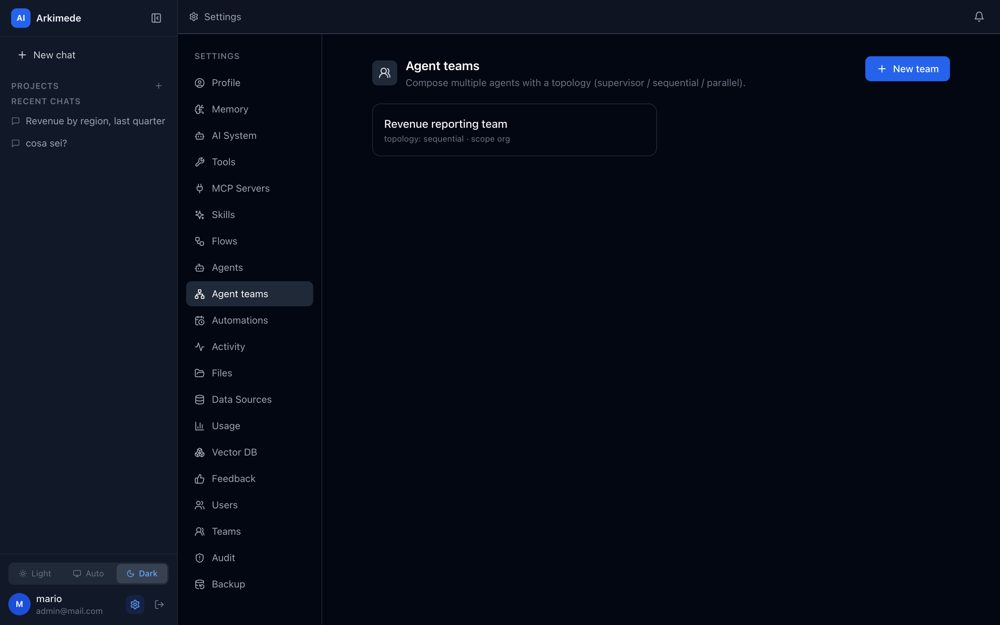
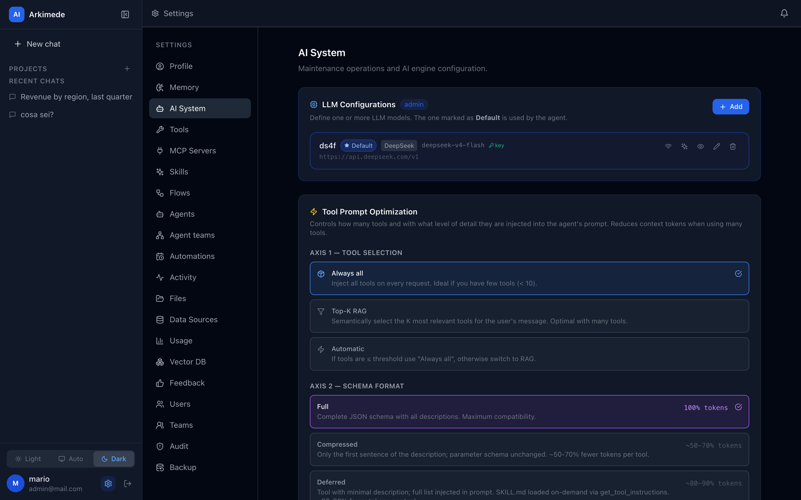

<div align="center">

# Arkimede

**The sovereign, self-hosted AI platform for teams.**
Run AI agents, deterministic workflows, and sandboxed custom code — multi-tenant, on your own infrastructure, with your data never leaving the building.

[](LICENSE)
[](docs/LICENSING.md#contributions)


🇬🇧 English · [🇮🇹 Italiano](README_it.md)



*The agent is asked which regions lost revenue. It picks the SQL tool, queries the warehouse, and answers. Then the same work — pull the numbers, write the digest, post it to the team — runs as a deterministic flow on a cron. **Improvisation and repeatability, in one system.***

</div>

---

## Why Arkimede?

Most self-hosted AI tools pick one lane: a chat UI (Open WebUI, LibreChat), an app/agent builder (Dify, Flowise), or a workflow automator (n8n). **Arkimede is the one place that combines all three under a real multi-tenant governance model** — so a whole organization can run AI on infrastructure it controls, without shipping data to a third-party SaaS.

The defensible combination, in one product:

- 🧠 **Stateful agents** (LangGraph ReAct) *and* 🔀 **deterministic workflows** (DAG canvas) — improvisation *and* repeatability.
- 🧩 **Executable Skills** — run untrusted Python/Node/JS in a hardened, per-job sandbox.
- 🔌 **Native MCP** (Model Context Protocol) — `http` · `sse` · `local` · `remote` transports.
- 🏢 **Multi-tenant by design** — org · team · user, with `personal | team | org` resource scoping and multi-team shared projects.
- 🗄️ **Heterogeneous data sources** — SQL (Postgres/MySQL/MSSQL/Oracle/SQLite), MongoDB, Redis, and file shares (SMB/SFTP/WebDAV).
- 🔒 **Capability-based security** — every power (network, filesystem, SQL ops, local MCP) is declared and approved, with safe defaults.

> **Data sovereignty is the point.** Bring your own LLM (Anthropic, OpenAI, Gemini, Ollama, LM Studio, DeepSeek, any OpenAI-compatible endpoint) or run models locally. Nothing leaves your perimeter unless you say so.

## How it compares

The two things an organization actually needs — **multi-tenant governance** and **OS-level isolation for untrusted code** — are exactly the two things the alternatives put behind an enterprise tier, a license restriction, or don't have at all.

| | **Arkimede** | Dify | n8n | Flowise | LibreChat | Open WebUI |
|---|---|---|---|---|---|---|
| **License** | AGPL-3.0 (OSI) | Modified Apache — *source-available* [^1] | Sustainable Use — *source-available* [^2] | Apache-2.0 core; `enterprise/` dir is proprietary [^3] | MIT (OSI) | BSD-3 + branding clause — *source-available* [^4] |
| **Multi-tenant governance**<br/>*(free, self-hosted)* | ✅ Org · teams · users, with `personal / team / org` scoping on every resource | ❌ One workspace. Multiple = Enterprise — **and the license forbids operating multi-tenant** [^1] | ❌ Projects, RBAC and sharing are all excluded from Community [^2] | ❌ Workspaces are Cloud/Enterprise only [^3] | ⚠️ Custom roles + per-resource ACLs + groups — but no org/tenant boundary | ⚠️ Groups + grant-only RBAC — but no org/tenant boundary |
| **Untrusted code execution** | ✅ Container **per job** — cap-drop, read-only rootfs, non-root, egress allowlist, optional gVisor | ✅ `dify-sandbox`: seccomp allowlist, but **one container shared by all tenants** | ⚠️ Task runners default to **internal** mode — n8n's own docs call it "a security risk" in production; real isolation means opting into external mode [^5] | ⚠️ `vm2` in-process; Python only via the E2B **cloud** SaaS | ✅ NsJail / libkrun microVM (Apache-2.0, self-hostable) | ❌ Runs **in-process** — docs call it "root-equivalent". Per-user containers are enterprise-licensed |
| **Deterministic workflows (DAG)** | ✅ 12 node types | ✅ | ✅ | ✅ | ❌ | ❌ |
| **Stateful agent (tool loop)** | ✅ LangGraph ReAct | ✅ | ✅ | ✅ | ✅ | ✅ |
| **MCP client transports** | `http` · `sse` · `local` (stdio) · `remote` | HTTP only (no stdio) | SSE + streamable HTTP | stdio + SSE + HTTP | stdio + SSE + HTTP | Streamable HTTP only, **admin-only** |
| **RAG** | ✅ Qdrant / PGVector / Chroma / Astra | ✅ | ✅ | ✅ | ✅ pgvector only, as a side service | ✅ |
| **GitHub stars** | *just getting started* | ~149k | ~196k | ~55k | ~41k | ~145k |

**Where they beat us — honestly.** All of them are years older, far more battle-tested, and have ecosystems we don't. n8n's integration catalogue (400+ nodes) is in a different league. Open WebUI and LibreChat are better *pure chat* clients, with more polish per screen. Dify has more model providers. If you want a mature single-workspace tool and multi-tenancy isn't a requirement, one of them is very likely the better call today.

**Pick Arkimede when** an organization — not one developer — has to run this: several teams, resources that must not leak across them, third-party code that must not touch the host, and data that must not leave the building.

*Verified against licenses, docs and source on 2026-07-14. Something wrong or out of date? [Open an issue](https://github.com/arkimedehq/arkimede/issues) — we'll fix the table.*

[^1]: [Dify's LICENSE](https://raw.githubusercontent.com/langgenius/dify/main/LICENSE): *"you may not use the Dify source code to operate a multi-tenant environment"* — and *"one tenant corresponds to one workspace"* — plus a no-logo-removal clause. GitHub classifies it `NOASSERTION`. In fairness: the five built-in roles *do* ship in the community edition ([account.py](https://github.com/langgenius/dify/blob/main/api/models/account.py)); only the granular [RBAC service](https://github.com/langgenius/dify/blob/main/api/services/enterprise/rbac_service.py) is enterprise-gated. Single-workspace confirmed by [pricing](https://dify.ai/pricing) and by the absence of a create-workspace endpoint.
[^2]: [n8n's Sustainable Use License](https://raw.githubusercontent.com/n8n-io/n8n/master/LICENSE.md): *"You may use or modify the software only for your own internal business purposes or for non-commercial or personal use."* Community exclusions (Projects, RBAC, sharing, SSO) per [n8n's own docs](https://docs.n8n.io/deploy/host-n8n/community-edition-features): *"In Community Edition, only the instance owner and the user who creates workflows or credentials can access them."*
[^3]: [Flowise LICENSE.md](https://github.com/FlowiseAI/Flowise/blob/main/LICENSE.md): Apache-2.0 except `packages/server/src/enterprise` and `IdentityManager.ts`, which carry a proprietary Commercial License — and that is exactly where the multi-tenancy code lives. Without an enterprise key the platform stays `OPEN_SOURCE` and its feature set is empty ([IdentityManager.ts](https://github.com/FlowiseAI/Flowise/blob/main/packages/server/src/IdentityManager.ts)).
[^4]: [Open WebUI's LICENSE](https://github.com/open-webui/open-webui/blob/main/LICENSE) (clause 4, since v0.6.6) forbids altering or removing its branding unless you have ≤50 end users in a rolling 30 days, written permission, or an enterprise license. To its credit, RBAC and SSO are *not* paywalled — but [per-user isolated execution containers are](https://github.com/open-webui/terminals/blob/main/LICENSE).
[^5]: [n8n's task-runner docs](https://docs.n8n.io/deploy/host-n8n/configure-n8n/set-up-task-runners): *"Using internal mode in production environments can pose a security risk. For production deployments, use external mode."* Internal is the default. Two things people often get wrong and we won't repeat: n8n no longer uses `vm2`, and its Python is no longer Pyodide.

*Everything above was read from the projects' own licenses, docs and source — not from secondary write-ups. Two claims worth correcting wherever you see them repeated: LibreChat's code interpreter is [no longer a paid hosted API](https://github.com/ClickHouse/code-interpreter) (Apache-2.0 and self-hostable since mid-2026), and Dify does ship roles in its community edition.*

## Screenshots

|  |  |
| :--: | :--: |
| <br/>**Chat** — a stateful agent that picks the right tool, runs it, and answers with the result. | <br/>**Flows** — deterministic DAG workflows: HTTP, LLM, conditions, tools, skills, sub-flows, on a cron. |
| <br/>**Tools** — custom REST / SQL / RAG / prompt tools, with encrypted secrets and `personal · team · org` scoping. | <br/>**Skills** — install executable Python/Node/JS packages from the registry; they run in a sandbox. |
| <br/>**Agent teams** — compose agents with a topology (supervisor / sequential / parallel) and expose the team as a tool. | <br/>**AI System** — multiple LLM configs (default / summarizer / vision) and tool-prompt optimization. |

## Quick start

> Requires Docker + Docker Compose. This spins up the full stack (Postgres, Qdrant, Redis, embedding & whisper services, skill executor, backend, frontend).
>
> **Footprint:** the full stack idles at **~2 GB RAM** — the two ML services dominate (embedding `mxbai-embed-large` ~1 GB, Whisper `small`/`int8` ~0.4 GB); everything else combined is under 550 MB. **4 GB RAM is a comfortable minimum**; 8 GB is recommended for real use (concurrent users, active RAG). CPU-only by default — no GPU needed. Plan ~10 GB disk for images, models and the persistent Nix store. Drop the embedding service (−1 GB) if you don't need RAG, or Whisper (−0.4 GB) if you don't need voice input.

```bash
git clone https://github.com/arkimedehq/arkimede.git
cd arkimede
./scripts/install.sh
```

The **guided installer** does everything: Docker preflight → generates all secrets → you pick an isolation level for skill/sandbox execution (**Standard / Isolated / Maximum**) → builds the required images → starts the stack. It's idempotent — safe to re-run. Afterwards, manage the stack with the wrapper it generates:

```bash
./scripts/compose.sh ps         # status
./scripts/compose.sh logs -f    # follow logs
./scripts/compose.sh down       # stop
```

To upgrade a running deployment to a newer version — backs up, pulls, rebuilds and restarts, preserving your data and config:

```bash
./scripts/update.sh
```

See [**Upgrading** in the guide](docs/GUIDE.md#28-upgrading-an-existing-deployment) for what it does and the manual equivalent.

<details>
<summary><b>Manual setup</b> (without the installer)</summary>

```bash
cp .env.example .env
```

Fill in the required secrets in `.env` (the backend **fails fast** if any are missing or weak — generate each with `openssl rand -hex 32`):

```bash
JWT_SECRET=          # min 32 random chars — app won't start otherwise
TOOL_SECRETS_KEY=    # 64 hex chars — AES-256-GCM key for secrets at rest
RUN_TOKEN_SECRET=    # signs internal run tokens
SERVICE_API_KEY=     # auth mesh: backend ↔ executor ↔ broker
DB_PASSWORD=         # Postgres password
```

Then start it:

```bash
# Development (exposes service ports, dev conveniences)
docker compose up -d

# Production (internal services have NO host ports; requires the secrets above)
docker compose -f docker-compose.yml up -d
```

For the isolation overlays (broker / egress allowlist) that `install.sh` wires automatically, see **[GUIDE.md](docs/GUIDE.md)**.

</details>

- Frontend → http://localhost:5173
- Backend API → http://localhost:3000 · Swagger → http://localhost:3000/api/docs

The **first user to register becomes the admin**. LLM providers, embeddings, and the vector DB are configured from the UI (**Settings → AI System**) — no API keys in files.

For non-Docker development, LAN access, and the optional hardening overlays, see **[GUIDE.md](docs/GUIDE.md)**.

## Deploy without building

Don't want to build from source? Use the **pull-based bundle** — a few KB of compose files
that pull pre-built images from the GitHub Container Registry (`ghcr.io/arkimedehq/arkimede-*`)
instead of compiling anything locally:

```bash
git clone https://github.com/arkimedehq/arkimede-deploy.git
cd arkimede-deploy
./install-hub.sh
```

`install-hub.sh` is the same guided flow as `install.sh` (secrets, isolation level, embedding
device) but it **pulls** the images rather than building them. Pin `ARKIMEDE_VERSION` in the
`.env` to a release tag for reproducible deployments. Full details in the
[arkimede-deploy](https://github.com/arkimedehq/arkimede-deploy) repo.

> Build-from-source (this repo, `./scripts/install.sh`) vs pull-and-run
> ([arkimede-deploy](https://github.com/arkimedehq/arkimede-deploy)) start the **same** stack —
> pick whichever fits your workflow.

## The four pillars

Beyond chat, four integrated systems — and they interconnect (flows are agent tools and can invoke agents/teams; automations run headless and may use a team):

| Pillar | What it does |
|---|---|
| 🤖 **Agent** | LangGraph ReAct agent with custom tools, MCP servers, RAG, and a 4-layer system prompt (base → user → project → skills). |
| 🔀 **Flows** | Visual DAG canvas for repeatable workflows. 12 node types (`tool`, `llm`, `condition`, `http`, `skill`, `transform`, `flow`, `agent`, `team`, `loop`, `join`, `chat`); triggers: manual, cron, scheduled, webhook, chat-as-tool. |
| 👥 **Multi-Agent** | Reusable agents composed into teams with `supervisor` / `sequential` / `parallel` topologies. Agent-as-tool for hierarchical delegation. |
| ⏰ **Auto-Scheduling** | Schedule automations *from chat* ("every morning at 8, check email and summarize"). Confirmed-by-default, headless runner, delivery via notification or a dedicated chat thread, with per-run token/cost guardrails. |

More capabilities: no-code **custom tools** (HTTP/SQL/RAG/prompt), **scope-aware RAG** (universal/project/personal), **DataSources**, **executable Skills**, an arbitrary-code **Sandbox** (`run_in_sandbox`), **SSE streaming** with automatic file detection, voice input (Whisper), i18n (EN/IT), and an Electron **bridge** for local MCP processes.

👉 Full feature reference and architecture: **[PROJECT.md](docs/PROJECT.md)**. Building Skills: **[SKILLS.md](docs/SKILLS.md)**.

## Tech stack

| Layer | Technology |
|---|---|
| Backend API + Agent | NestJS 10 (TypeScript) |
| AI orchestration | LangChain.js + LangGraph |
| LLM | UI-configurable: Anthropic, OpenAI, Gemini, Ollama, LM Studio, DeepSeek, any OpenAI-compatible |
| Frontend | React 18 + Vite + Tailwind CSS |
| App database | PostgreSQL + TypeORM |
| Vector DB | Qdrant (default) / PGVector / Chroma / AstraDB |
| Queue / scheduler | BullMQ + Redis |
| Skill executor | Node.js (Fastify) sidecar — Python/JS/Node runners |
| Skill isolation | Egress allowlist (Squid), declared `network`/`filesystem` capabilities, per-job containers via broker (cap-drop, read-only, non-root, optional gVisor) |
| Packaging | Docker Compose (secure base + `egress`/`broker` overlays) |

## Architecture

```
[Browser]
    │
    ├── React SPA (Vite + Tailwind) — JWT auth · SSE streaming · file upload
    │
    └── REST + SSE /api/* ◄─────────────────────────────────────────────┐
                   ▼                                                      │
           NestJS Backend :3000                                          │
                   │                                                      │
              AgentModule — LangGraph ReAct Agent                        │
                   │                                                      │
    ┌──────────────┼──────────────────────────┐                          │
    ▼              ▼              ▼            ▼                          │
CustomTools    McpServers   DataSources   VectorDb                       │
 http/sql/rag  http/sse/    SQL/Mongo/    Qdrant/PGV/                     │
               local/remote Redis         Chroma/Astra                   │
                   │                                                      │
              McpBridgeGateway (WebSocket /mcp-bridge)                    │
                   │                                                      │
              Electron Bridge ◄────────────────────────────────────────┘
              └─ McpProcess (stdio → JSON-RPC)
```

## Security & isolation

Arkimede uses a **capability model**: every power (network, filesystem, SQL operations, `local` MCP) is *declared and approved*, with safe defaults and a ceiling tied to identity — never implicit and global.

- **AES-256-GCM** authenticated encryption for secrets; `TOOL_SECRETS_KEY` mandatory (fail-fast).
- **Secure Docker prod**: internal services have no host ports; passwords required.
- **`local` MCP** restricted to admins; **SSRF guard** on `http`/`sse` (blocks cloud metadata, RFC1918, localhost).
- **Skills** (untrusted third-party code): egress allowlist, per-tenant access-aware filesystem, hardened per-job containers via the broker, declared capabilities, package checksums.
- **Structured audit log** on chokepoints (auth, admin, executions, files, SQL, MCP) with "runs-as" identity.

## Documentation

| Doc | Contents |
|---|---|
| [PROJECT.md](docs/PROJECT.md) | Full product & architecture deep-dive |
| [GUIDE.md](docs/GUIDE.md) | Usage & development guide (setup, overlays, LAN, dev notes) |
| [SKILLS.md](docs/SKILLS.md) | How to build Skills (schema, templates, conventions) |
| [MEMORY.md](docs/MEMORY.md) | Agentic memory (A-MEM) design |
| [LICENSING.md](docs/LICENSING.md) | License (AGPL-3.0) & contribution terms |
| [THIRD_PARTY_NOTICES.md](docs/THIRD_PARTY_NOTICES.md) | Third-party attributions |

## Contributing

Contributions are welcome! They are accepted under the project's license — **AGPL-3.0**, *inbound = outbound*: by opening a Pull Request you agree to license your contribution under AGPL-3.0. No CLA — just a lightweight [DCO](DCO) sign-off (`git commit -s`). See [CONTRIBUTING](CONTRIBUTING.md).

## Support the project

Arkimede is free and open source under AGPL-3.0. If it is useful to you or your organization, you can support its ongoing development through [GitHub Sponsors](https://github.com/sponsors/andreagenovese). Sponsorship is entirely voluntary: it does **not** change the license or grant any additional rights — it simply helps sustain maintenance and new features.

## License

Arkimede is free and open source under the **GNU AGPL-3.0** (see [LICENSE](LICENSE) and [LICENSING.md](docs/LICENSING.md)):

- 🆓 Free to use, modify, and self-host — including as a network service (SaaS) — **provided you make the corresponding source code available under AGPL-3.0** (network copyleft, art. 13).
- The software is provided **"AS IS", without warranty or liability** (AGPL-3.0 §15–16).

Third-party dependencies are almost entirely **permissive** (MIT, ISC, BSD, Apache-2.0); the only third-party copyleft is `lightningcss` (**MPL-2.0**, build tooling, not shipped at runtime). **No third-party GPL/LGPL/AGPL.** (Arkimede's own vendored, clean-room NTLM module is AGPL like the rest of the project — first-party, not a dependency.) See [THIRD_PARTY_NOTICES.md](docs/THIRD_PARTY_NOTICES.md).
