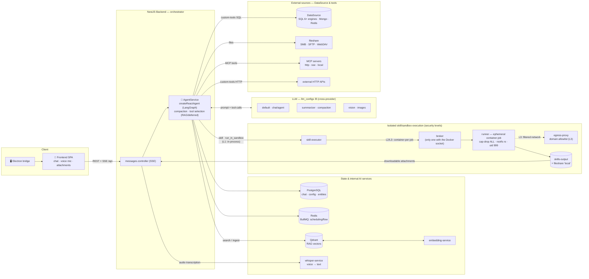
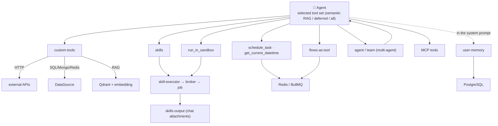
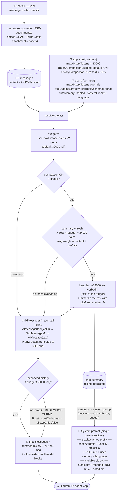
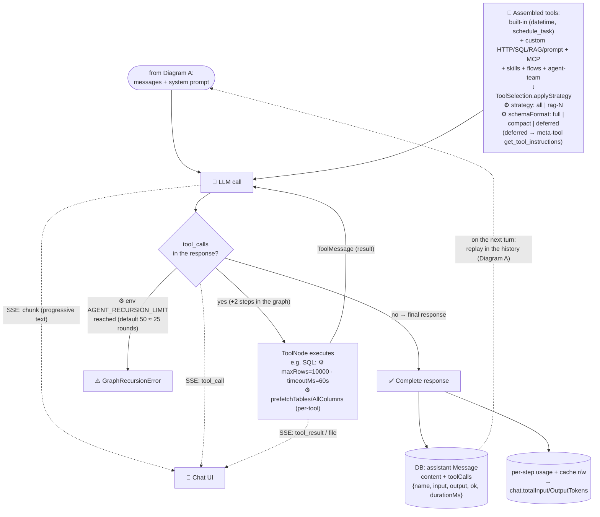

# Agent Dataflow — from user prompt to response

Complete path of a chat message: entry, config/threshold resolution, compaction,
context building, agent↔tool loop, streaming and persistence.
References: `backend/src/agent/agent.service.ts` (streamResponse → resolveAgent →
compactHistory → buildMessages → createReactAgent) and `messages.controller`.

Legend: ⚙️ = configurable (admin or user) · 🔒 = hardcoded constant

## Diagram 0 — Overview: the agent and the services

High-level map: how a message comes in, how the agent (LangGraph
`createReactAgent`) reasons with the LLM, and which services/sources it touches through the tools.
The loop and compaction details are in Diagrams A–C.

## Diagram 0b — Agent tool fan-out

From the same selected tool set, each category routes to a different service.
The user-memory is not a tool: it is merged into the system prompt.

**How to read them together:** Diagram 0 is the topology (who talks to whom);
Diagram 0b is the tool fan-out (which service each category touches); Diagrams
A–C below are the runtime detail of a single message (context, compaction, tool
loop, streaming).

## Diagram A — Context preparation (phases 1–4)

## Diagram B — Agent loop, tools and output (phases 5–6)

## Thresholds and parameters

### Configurable ⚙️ (admin or user)

| Parameter | Where it is configured | Default | Effect on the flow |
|---|---|---|---|
| `maxHistoryTokens` | Admin settings (`app_config`) | 30000 | History token budget: baseline for the compaction trigger (A) and the trim ceiling (A) |
| `users.maxHistoryTokens` | User profile (override) | null = use global | Replaces the global budget for that user |
| `historyCompactionEnabled` | Admin settings (`app_config`) | **true** | Enables the rolling summary; off → trim only (old context is lost) |
| `historyCompactionThreshold` | Admin settings (`app_config`) | 80% (clamp 50–95) | % of the budget beyond which compaction triggers (80% × 30000 = 24000 tok) |
| `toolLoadingStrategy` / `toolLoadingMaxTools` | User profile | all | Which/how many tools get injected (semantic RAG selection over the manifests) |
| `toolSchemaFormat` | User profile | full | `deferred` = SKILL.md on-demand via `get_tool_instructions` (lighter prompt) |
| `autoMemoryEnabled` | User profile | off | Injects the confirmed facts of the user memory into the stable prefix |
| Base / user / project system prompt | Admin / profile / project | — | The 4 prompt levels |
| LLM default + summarizer + vision | `llm_configs` | — | Agent-loop model, rolling-summary model, model for multimodal tasks (image OCR) |
| `maxRows`, `timeoutMs`, `prefetchTables`, `prefetchAllColumns` | `executorConfig` of the individual SQL tool | 10000 / 60s / on | Tool output size (heavily affects history weight) |
| `AGENT_RECURSION_LIMIT` | backend env (`.env`) | 50 (~25 LLM rounds, min 10) | LangGraph step limit per message on `stream()`/`invoke()`; exceeded → `GraphRecursionError` |
| `REPLAY_TOOL_OUTPUT_MAX_CHARS` | backend env (`.env`) | 3000 char (min 500) | Cap for tool output re-injected into the history (replay of previous turns) |

### Hardcoded 🔒

The remaining constants are **correctness invariants or algorithm details**, not tuning
knobs: exposing them in env would allow configurations that break the system.

| Constant | Value | Where | Why it stays hardcoded |
|---|---|---|---|
| Trim | `last` · `startOn:'human'` · `allowPartial:false` | `buildMessages` | API invariant: changing these values can produce orphan `tool_use` or split turns → 400 from the providers |
| Keep-budget compaction | 50% of the trigger | `compactHistory` | Anti-thrashing detail of the algorithm: high values trigger compaction on every turn |
| Feedback-memory | 3 hits | `resolveAgent` | Prompt micro-tuning; if it ever needs adjusting, the right place is `app_config` (next to the toggle), not env |

## Operational notes

- **The budget is always applied** (trim), even with compaction off: the toggle only
  decides whether the excess becomes a summary (memory preserved) or is discarded (memory
  lost). Since the `RaiseHistoryBudget` migration the defaults are a 30000 tok
  budget and compaction ON — previously they were 6000/OFF, too tight for agentic chats with SQL tools.
- The "true" weight of a message in history is `content + toolCalls`: SQL tools with
  prefetch can produce output of tens of kTokens — this is why the replay cap
  (3000 char) and the compaction estimate that also counts the toolCalls exist.
- The summary does NOT consume history budget: it lives in the system prompt (the only valid
  location for all providers), in a separate block so as not to invalidate the Anthropic prompt-cache
  of the stable prefix.
