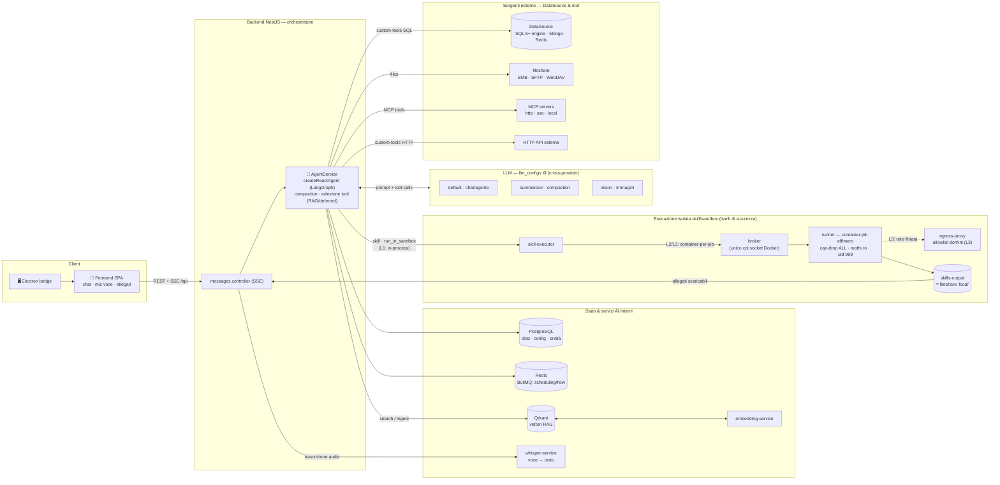
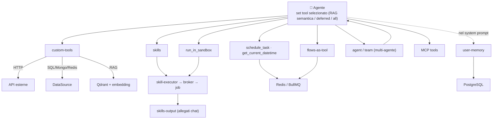
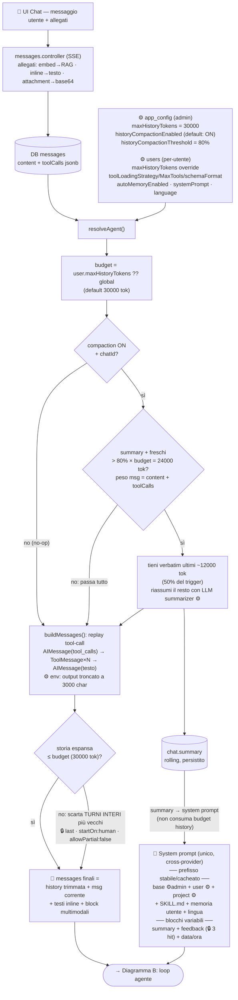
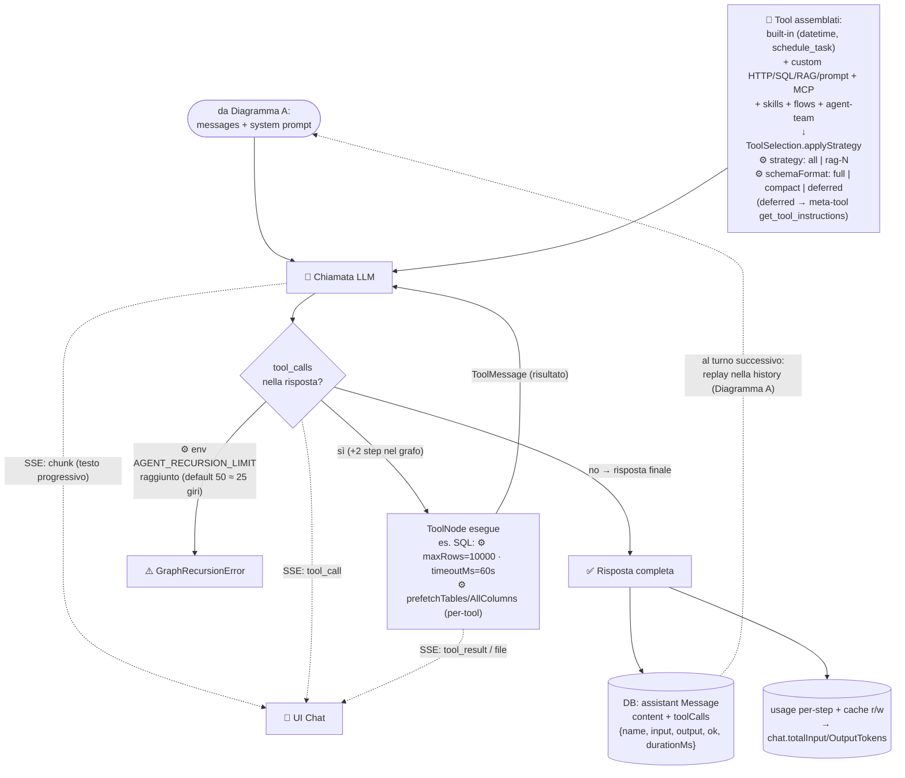

# Dataflow Agent — dal prompt utente alla risposta

Percorso completo di un messaggio chat: ingresso, risoluzione config/soglie, compaction,
costruzione del contesto, loop agente↔tool, streaming e persistenza.
Riferimenti: `backend/src/agent/agent.service.ts` (streamResponse → resolveAgent →
compactHistory → buildMessages → createReactAgent) e `messages.controller`.

Legenda: ⚙️ = configurabile (admin o utente) · 🔒 = costante hardcoded

## Diagramma 0 — Vista d'insieme: l'agente e i servizi

Mappa di alto livello: come un messaggio entra, come l'agente (LangGraph
`createReactAgent`) ragiona col LLM e quali servizi/sorgenti tocca tramite i tool.
I dettagli del loop e della compaction sono nei Diagrammi A–C.

## Diagramma 0b — Fan-out dei tool dell'agente

Dallo stesso set di tool selezionato, ogni categoria instrada verso un servizio
diverso. La user-memory non è un tool: viene fusa nel system prompt.

**Come leggerli insieme:** il Diagramma 0 è la topologia (chi parla con chi); il
Diagramma 0b è il fan-out dei tool (quale servizio tocca ciascuna categoria); i
Diagrammi A–C sotto sono il dettaglio runtime di un singolo messaggio (contesto,
compaction, loop tool, streaming).

## Diagramma A — Preparazione del contesto (fasi 1–4)

## Diagramma B — Loop agente, tool e output (fasi 5–6)

## Soglie e parametri

### Configurabili ⚙️ (admin o utente)

| Parametro | Dove si configura | Default | Effetto nel flusso |
|---|---|---|---|
| `maxHistoryTokens` | Settings admin (`app_config`) | 30000 | Budget token della history: base per trigger compaction (A) e tetto del trim (A) |
| `users.maxHistoryTokens` | Profilo utente (override) | null = usa global | Sostituisce il budget globale per quell'utente |
| `historyCompactionEnabled` | Settings admin (`app_config`) | **true** | Accende il rolling summary; spento → solo trim (il contesto vecchio si perde) |
| `historyCompactionThreshold` | Settings admin (`app_config`) | 80% (clamp 50–95) | % del budget oltre cui scatta la compaction (80% × 30000 = 24000 tok) |
| `toolLoadingStrategy` / `toolLoadingMaxTools` | Profilo utente | all | Quali/quanti tool vengono iniettati (selezione semantica RAG sui manifest) |
| `toolSchemaFormat` | Profilo utente | full | `deferred` = SKILL.md on-demand via `get_tool_instructions` (prompt più leggero) |
| `autoMemoryEnabled` | Profilo utente | off | Inietta i fatti confermati della memoria utente nel prefisso stabile |
| System prompt base / utente / progetto | Admin / profilo / progetto | — | I 4 livelli del prompt |
| LLM default + summarizer + vision | `llm_configs` | — | Modello del loop agente, modello dei rolling summary, modello per task multimodali (OCR immagini) |
| `maxRows`, `timeoutMs`, `prefetchTables`, `prefetchAllColumns` | `executorConfig` del singolo tool SQL | 10000 / 60s / on | Dimensione output dei tool (incide molto sul peso della history) |
| `AGENT_RECURSION_LIMIT` | env backend (`.env`) | 50 (~25 giri LLM, min 10) | Limite step LangGraph per messaggio su `stream()`/`invoke()`; superato → `GraphRecursionError` |
| `REPLAY_TOOL_OUTPUT_MAX_CHARS` | env backend (`.env`) | 3000 char (min 500) | Cap per output di tool ri-iniettati nella history (replay dei turni precedenti) |

### Hardcoded 🔒

Le costanti restanti sono **invarianti di correttezza o dettagli d'algoritmo**, non manopole
di tuning: esporle in env permetterebbe configurazioni che rompono il sistema.

| Costante | Valore | Dove | Perché resta hardcoded |
|---|---|---|---|
| Trim | `last` · `startOn:'human'` · `allowPartial:false` | `buildMessages` | Invariante API: cambiare questi valori può produrre `tool_use` orfani o turni spezzati → 400 dai provider |
| Keep-budget compaction | 50% del trigger | `compactHistory` | Dettaglio anti-thrashing dell'algoritmo: valori alti fanno scattare la compaction a ogni turno |
| Feedback-memory | 3 hit | `resolveAgent` | Micro-tuning del prompt; se mai servisse regolarlo, la sede giusta è `app_config` (accanto al toggle), non l'env |

## Note operative

- **Il budget è applicato sempre** (trim), anche con compaction spenta: il toggle decide
  solo se l'eccedenza diventa un summary (memoria conservata) o viene scartata (memoria
  persa). Dal 2026-06-11 (migration `RaiseHistoryBudget`) i default sono budget 30000 tok
  e compaction ON — prima erano 6000/OFF, troppo stretti per chat agentiche con tool SQL.
- Il peso "vero" di un messaggio in history è `content + toolCalls`: i tool SQL con
  prefetch possono produrre output da decine di kToken — per questo esistono il cap di
  replay (3000 char) e la stima compaction che conta anche i toolCalls.
- Il summary NON consuma budget history: vive nel system prompt (unica sede valida per
  tutti i provider), in un blocco separato per non invalidare la prompt-cache Anthropic
  del prefisso stabile.
